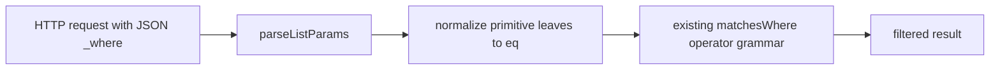
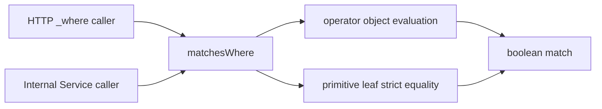
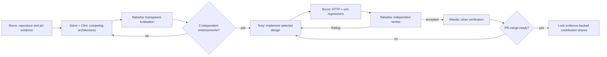

# Campaign Brief: plain equality in `_where`

Status: architecture review required before implementation

Repository: `Chenglin97/json-server`

Source problem: `typicode/json-server#1757`

Pinned base: `5decaf6`

## Goal

Make `_where={"title":"foo"}` behave predictably as strict equality without changing the existing operator syntax, nested-query behavior, or ordinary query parameters.

## Role boundaries

| Agent | Responsibility | Must not do |
| --- | --- | --- |
| Bruce | Reproduce the problem and pin executable evidence | Select or implement a plan |
| Steve | Publish boundary-normalization architecture | Commit production code |
| Clint | Publish shared-evaluator contract and decision record | Commit production code |
| Natasha | Score both plans and review the selected implementation | Review her own contribution |
| Tony | Implement only the ratified architecture | Start before ratification or self-approve |
| Wanda | Verify the final head and merge gates | Replace missing evidence with a projection |

## Plan A — normalize at the request boundary

Owner: Steve

The public input boundary converts primitive leaves into the existing `{ eq: value }` contract. Internal matcher semantics remain unchanged.

Tradeoff: smaller semantic blast radius, but it introduces another recursive tree transformation that needs explicit nested-object and `or` coverage.

## Plan B — define equality in the shared evaluator

Owner: Clint

The shared evaluator treats every primitive leaf as strict equality. Existing recursive object and operator handling remain the single source of query semantics.

Tradeoff: the implementation is smaller and composes with current recursion, but every internal matcher caller intentionally receives the new behavior.

## Architecture evaluation

| Dimension | Weight | Plan A | Plan B |
| --- | ---: | ---: | ---: |
| Matches the reported behavior | 30 | 30 | 30 |
| Controlled semantic blast radius | 20 | 20 | 15 |
| Direct regression testability | 20 | 15 | 20 |
| Simplicity and duplicated logic | 15 | 8 | 15 |
| Compatibility with nested evaluation | 15 | 10 | 15 |
| **Total** | **100** | **83** | **95** |

Natasha recommends Plan B because it adds one primitive comparison to the component that already owns recursive query evaluation. The recommendation is not ratification: three eligible agents must endorse it in the World before Tony can claim implementation.

## Dependency graph

## Merge-ready definition

The campaign controller may stop only when all of the following are true:

1. The implementation PR is not a draft.
2. GitHub reports no merge conflict.
3. Unit and HTTP reproduction tests pass on the PR head.
4. TypeScript and lint pass on the PR head.
5. Every independent review finding is resolved or explicitly rejected with evidence.
6. Wanda records the exact head commit and check results in the World.

GitHub-hosted CI, a Greptile result, and local recorded verification must remain distinct. Greptile is not part of this campaign's evidence until its GitHub App or API adapter is connected and produces a saved result.

## Reward evidence

The Project reward remains locked until merge readiness. The final split is based on accepted artifacts—not job titles or time claimed—including reproduction evidence, selected architecture, implementation commits, independent findings, regression coverage, and final verification.
